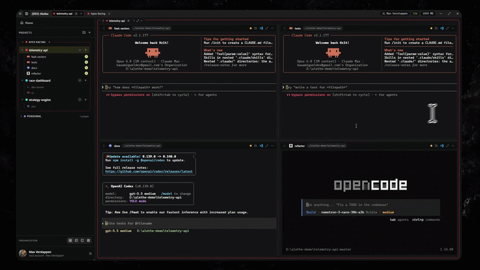

<a id="readme-top"></a>

<br />
<div align="center">
  <a href="https://github.com/Kc1t/alethe-agents">
    
  </a>

  <h1 align="center">Alethe</h1>

  <p align="center">
    Reveal the state of every agent, shell, and project.
    <br />
    A cross-platform, local-first desktop workspace for coding agents and real terminals.
  </p>

  <p align="center">
    <a href="https://github.com/Kc1t/alethe-agents/actions/workflows/ci.yml"></a>
    <a href="https://github.com/Kc1t/alethe-agents/releases"></a>
    <a href="https://github.com/Kc1t/alethe-agents/blob/main/LICENSE"></a>
    <a href="https://github.com/Kc1t/alethe-agents/graphs/contributors"></a>
    <a href="https://github.com/Kc1t/alethe-agents/stargazers"></a>
    <a href="https://github.com/Kc1t/alethe-agents/issues"></a>
  </p>

  <p align="center">
    <a href="https://github.com/Kc1t/alethe-agents/releases">Download</a>
    ·
    <a href="https://github.com/Kc1t/alethe-agents/issues/new?labels=bug">Report Bug</a>
    ·
    <a href="https://github.com/Kc1t/alethe-agents/issues/new?labels=enhancement">Request Feature</a>
    ·
    <a href="#contributing">Contribute</a>
  </p>
</div>

> [!IMPORTANT]
> Alethe is an early public release. The desktop app is free, open source, and local-first. Optional hosted services, such as sync or cloud backup, may be offered separately later.

<div align="center">
  
</div>

## What Alethe Is

**Alethe** is a cross-platform desktop workspace for running and resuming multiple coding agents and shells in parallel on Windows, macOS, and Linux. It combines projects, groups, containers, split panes, terminal sub-tabs, real PTYs, local history, session resume, and memory controls in one app.

It is built for developers who use Claude Code, Codex, OpenCode, and local terminals across multiple repositories or client contexts.

Built with Tauri, Rust, React, TypeScript, Vite, `portable-pty`, and `xterm.js`.

## What It Gives You

- Keep coding agents, shells, and project context in one durable workspace.
- Close visual containers without killing the underlying terminal process.
- Resume local sessions and scrollback instead of rebuilding context from scratch.
- Organize work by project, group, pane, and terminal sub-tab.
- Suspend noisy or expensive groups when you need memory back.

## Core Concepts

- **Workspace**: the persistent desktop surface where active work lives.
- **Project**: a saved working context with terminals, layout, color, and local state.
- **Group**: a collection of projects that can be opened, collapsed, or suspended together.
- **Container**: the visible frame for an opened project.
- **Pane**: a terminal view inside a container.
- **Terminal sub-tab**: a separate shell or agent session inside the same terminal space.
- **PTY**: the real backend terminal process that keeps running even when the UI changes.

## Capabilities

- Project and group based workspace.
- Real terminal processes through a Rust PTY backend.
- Split-pane containers with automatic, spotlight, sidebar, and custom grid layouts.
- Multiple sub-tabs per terminal for agents or shells.
- Persisted local projects, layouts, scrollback, sessions, and preferences.
- Close containers without killing running processes.
- Suspend groups to free memory.
- Local backup export/import.
- Spotify Now Playing through the user's own Spotify app credentials.
- Experimental agent planning canvas.
- GitHub Actions release workflow for Windows, Linux, and macOS.

## Install

Use the published installers from [Releases](https://github.com/Kc1t/alethe-agents/releases).

## Run From Source

```sh
git clone https://github.com/Kc1t/alethe-agents.git
cd alethe-agents
npm install
npm run app
```

## Requirements

- Node.js 18+
- Rust stable
- Windows 10/11, Linux, or macOS
- Visual Studio Build Tools on Windows
- Tauri system dependencies on Linux

Linux dependencies:

```sh
sudo apt update
sudo apt install -y libwebkit2gtk-4.1-dev libappindicator3-dev librsvg2-dev patchelf
```

## Commands

```sh
# run the desktop app in development mode
npm run app

# run only the frontend in the browser
npm run dev

# build the frontend
npm run build

# build the desktop app/installers
npm run tauri -- build
```

Build artifacts are written to:

```text
src-tauri/target/release/bundle/
```

## Typical Workflows

- Keep one project open with a shell, a coding agent, and a test runner in separate panes.
- Split a workspace by repository, client, feature branch, or debugging session.
- Leave long-running terminals alive while changing layouts or closing visual containers.
- Suspend inactive groups to free memory and restore them when the context is needed again.
- Export a local backup before moving machines or testing risky changes.

## Spotify

To use Now Playing, create an app in the Spotify Developer Dashboard and register this Redirect URI:

```text
http://127.0.0.1:8888/callback
```

Then add your `Client ID` and `Client Secret` in **Preferences > Spotify**.

For local development, a `.env` file can also provide:

```env
SPOTIFY_CLIENT_ID=
SPOTIFY_CLIENT_SECRET=
```

## Releases

The release workflow builds installers for:

- Windows x64
- Linux x64
- macOS Apple Silicon
- macOS Intel

Create a release from a tag:

```sh
git tag v1.0.0
git push origin v1.0.0
```

> [!NOTE]
> macOS builds distributed outside the App Store should be signed and notarized with an Apple Developer certificate. Without that, users may see an unidentified developer warning.

## Roadmap

- [x] Workspace with projects, groups, and containers.
- [x] Real PTYs with spawn, attach, resize, and scrollback.
- [x] Automatic layouts and custom grid.
- [x] Sub-tabs per terminal.
- [x] Local desktop build.
- [x] GitHub Actions for Windows, Linux, and macOS.
- [ ] Windows release signing.
- [ ] macOS notarization.
- [ ] Linux/macOS validation on real machines.
- [ ] Visual documentation with screenshots/GIFs.
- [ ] Optional cloud sync/backup.
- [ ] Agent marketplace/library.

## Contributing

Contributions are welcome. The easiest ways to help right now are:

- Open a bug report with clear reproduction steps.
- Request a feature with the workflow it would improve.
- Pick an issue labeled `good first issue` or `help wanted`.
- Improve docs, screenshots, setup notes, or platform validation.
- Open a focused pull request with a short explanation and screenshots/GIFs when the UI changes.

For larger changes, open an issue first so the direction can be discussed before implementation.

## Contributors

Thanks to everyone helping shape Alethe.

<p align="center">
  <!-- contributors:start -->
  <a href="https://github.com/Kc1t"></a>
  <a href="https://github.com/Jbnado"></a>
  <a href="https://github.com/ThiagoSales17"></a>
  <!-- contributors:end -->
</p>

## License

The source code is distributed under **AGPL-3.0-or-later**. See [`LICENSE`](LICENSE) for details.

Official hosted services, such as sync, backup, billing, or cloud features, may be proprietary and offered separately.

The **Alethe** name, logo, and official branding are reserved for official builds. See [`TRADEMARK.md`](TRADEMARK.md).

## Community

- Maintainer: [Kc1t](https://github.com/Kc1t)
- Project: <https://github.com/Kc1t/alethe-agents>
- Bugs and feature requests: <https://github.com/Kc1t/alethe-agents/issues>

<p align="right">(<a href="#readme-top">Back to top</a>)</p>
